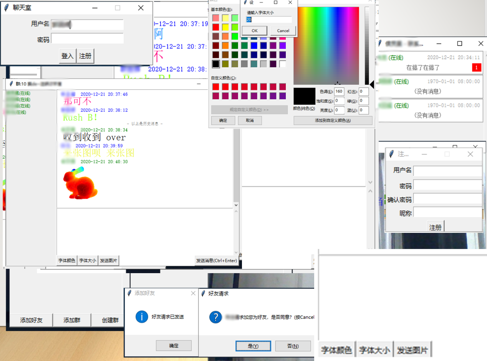

# Chart_room_with_face_reco
 带有人脸识别的聊天室
 
## 登录方式加入了人脸识别验证功能
## 功能大致如下： 
1.注册，用户需要创建用户名和密码进行注册 
2.登录，通过注册的用户名和密码进行登录 
3.好友添加请求，当有用户需要添加好友时提醒 
4.好友聊天，可以一对一进行私密聊天 
5.群组聊天，可以创建群组群组内成员可以广播聊天 
6.图像传输，聊天过程中可以实现图像发送和接收 
7.上线提醒，当一个好友上线时进行提醒 
8.实时消息接收，两个用户之间的消息传输保证实时性 
9.未读消息延迟上线接收 

## 效果图：

  

### 使用方式 
	服务端：python run_server.py
	客服端：python run_client.py
